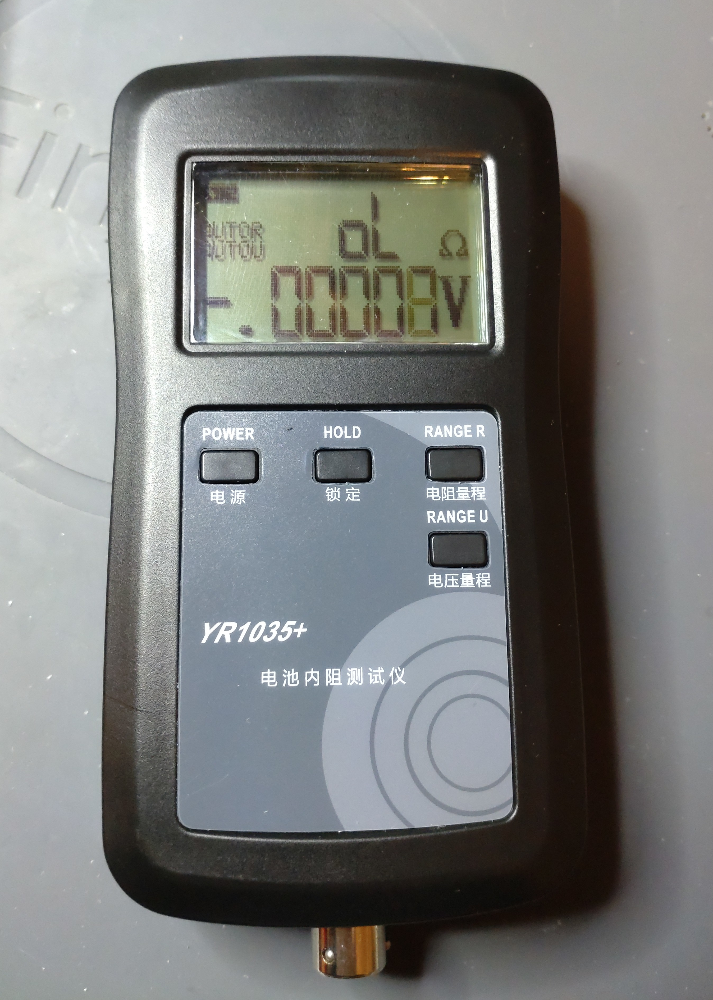
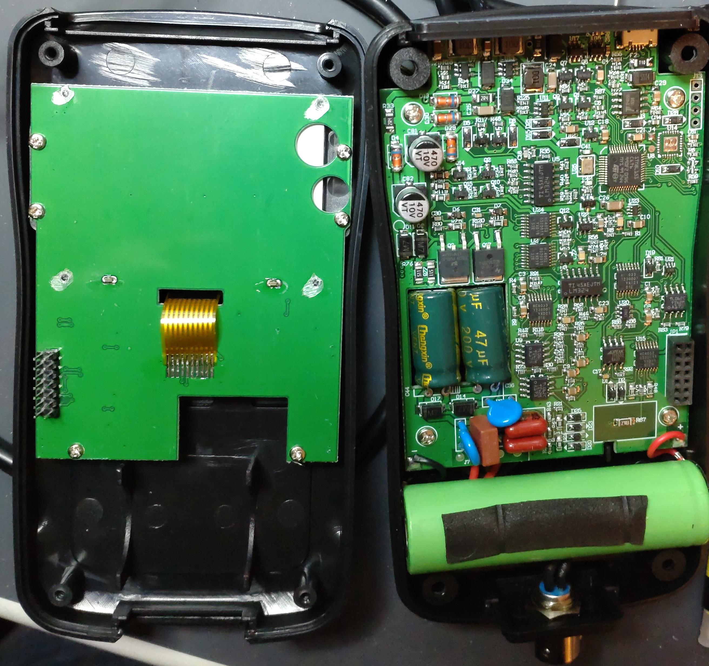
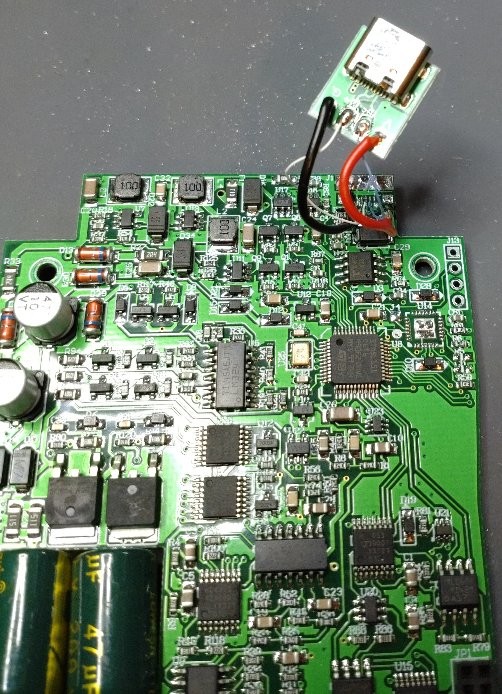
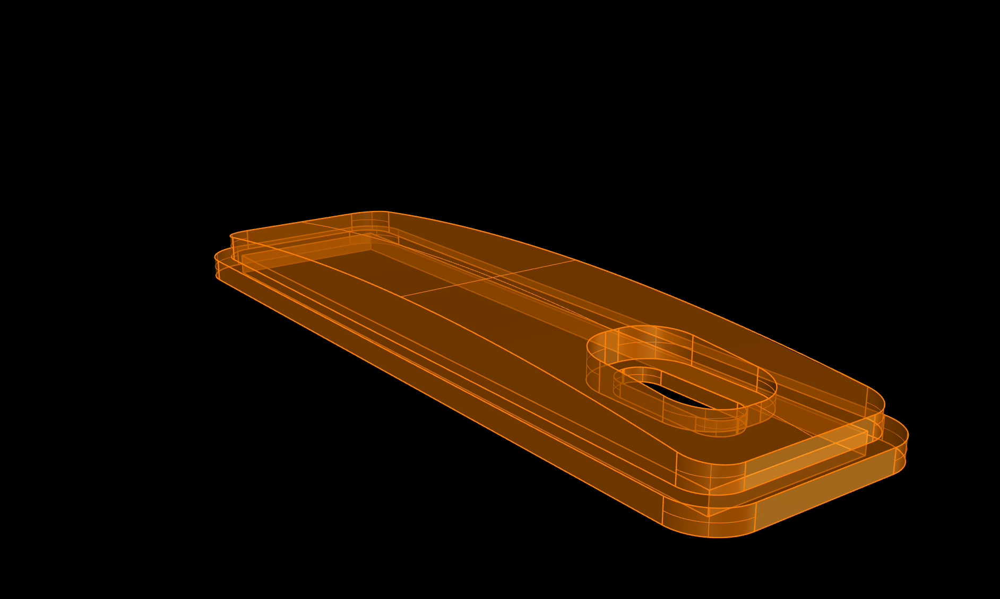
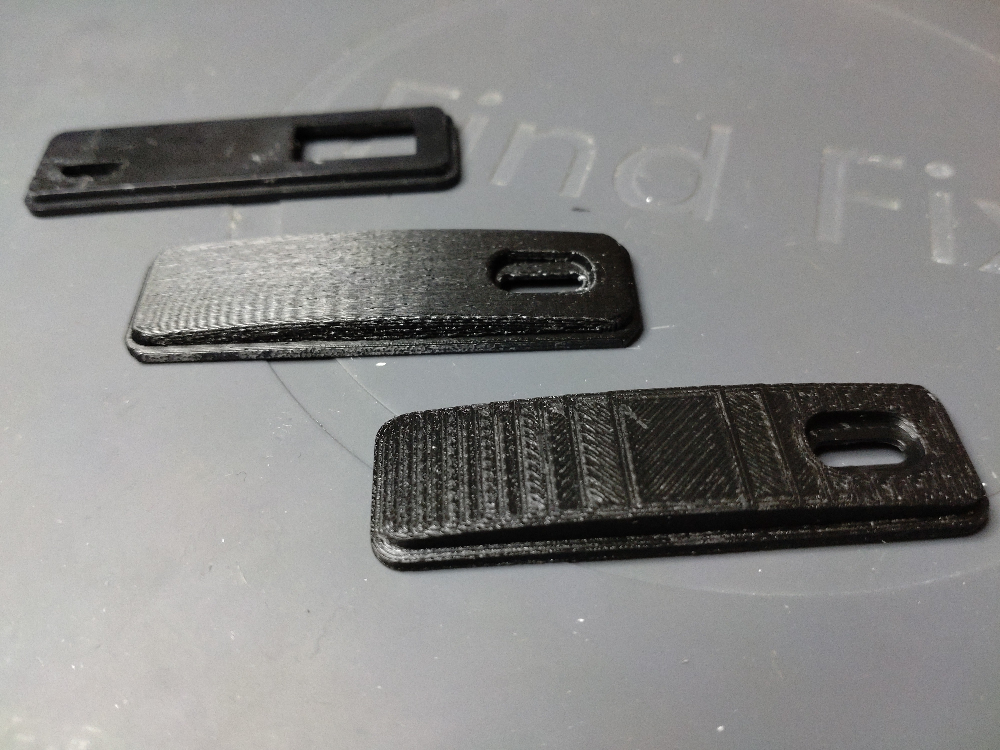
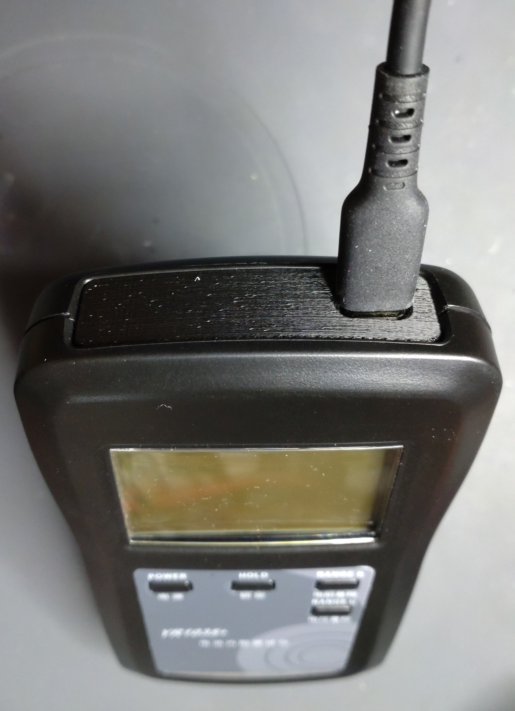
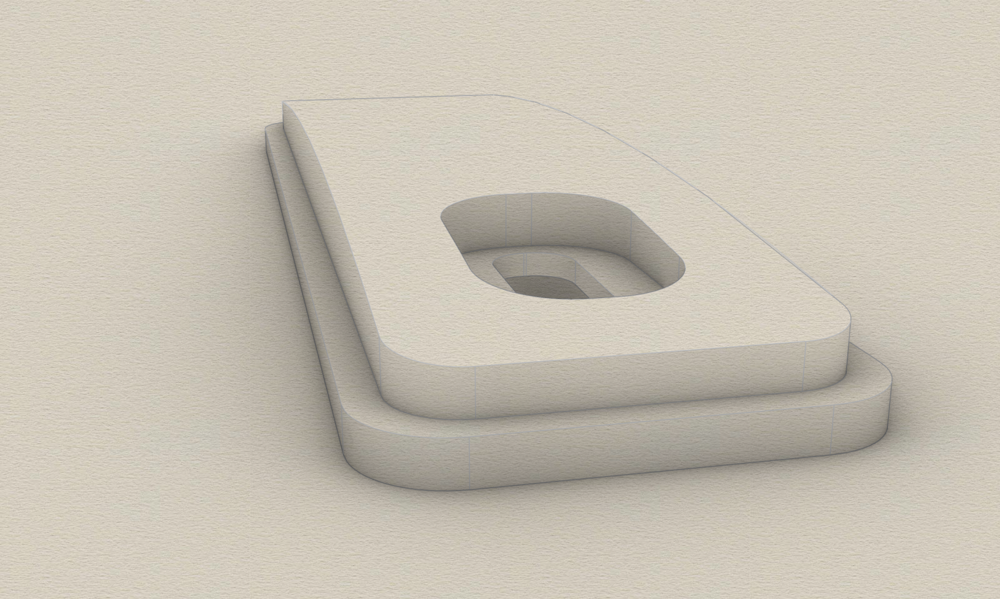

# YR1035-housing-cover
3D printable cover for YR1035+ battery resistance measurement device. Created with Rhino 8.

Recently a friend pointed me to the YR1035+ battery resistance measurement device. When the device arrived, i noticed that it had an MicroUSB Typ-B connector for charging on the top side. The device i was pointed to by a friend has had an USB-C charging port. I decided to remove the MicroUSB Type B connector from the board and install an USB-C adapter board. The top cover seems to be a multipurpose cover. There was not only a hole for the MicroUSB Type-B connector but also another rectangular hole, covered by sticker.
When i assembled the parts together, it looked realy bad. So i decided to create a cover that fits to the USB-C connector.
I printed it flat and upside. The later one looks great. 

Requirements:
* 3D printer 
* Filament of your choice (i used PETG)

## View

 

 

 

 

  
